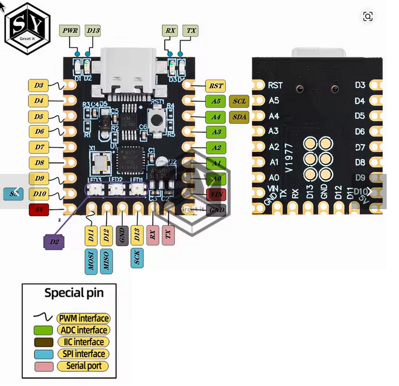
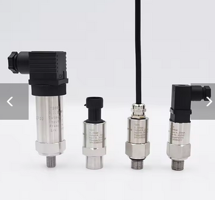
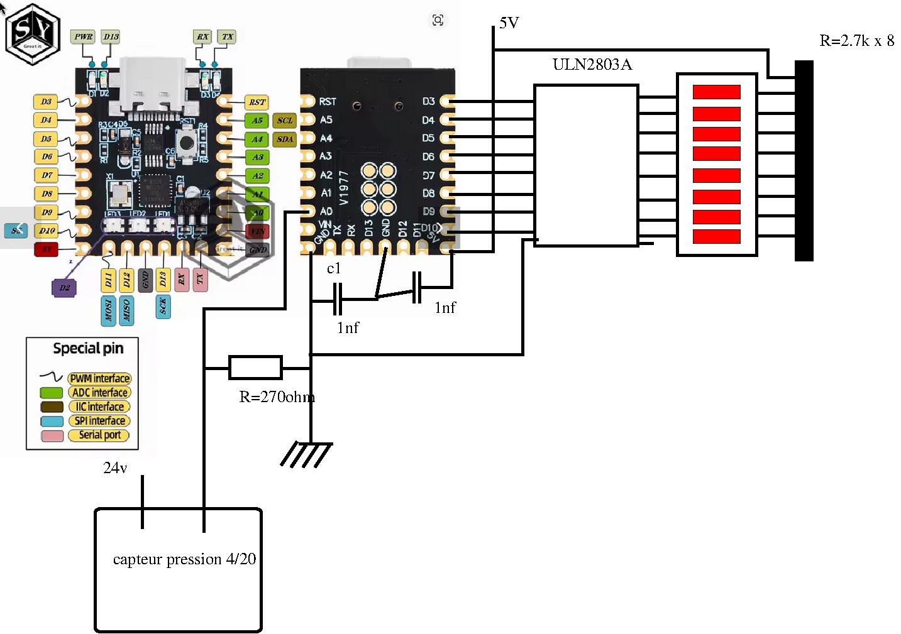

🔧 How It Works
1bar = 10 meter (approximatly)




This system monitors and visualizes the fill level of an underground fuel/oil tank using:

    A 0–1 bar pressure sensor (measuring static head pressure),
    An Arduino Nano for signal processing and control,
    A 8-LED bar for intuitive visual feedback,
    A solid-state relay (SSR) to automate a pump based on level thresholds.

📊 Calibration & Real-World Parameters

in my home my tank is outdoor, and at 2 meter, i use it for the garden, and full it with a pump from underground or rain water, so i bought a 4-20 pressure sensors t osee if i need to full it or not




All calculations are based on empirical measurements (not just theoretical formulas), making the system robust to sensor drift or installation-specific conditions:
Parameter
	
Value
Empty tank  0.00 bar (4.28 mA)

Full tank 0.21 bar (7.46 mA)

Pump shut-off (dynamic) 0.43 bar (prevents overfill during pump operation)

Pump start threshold ≤15% level

10-sample moving average on analog readings
🌟 Key Features

    ✅ Startup LED test — visual confirmation of all LEDs and level simulation  
    📈 Progressive LED bar — linear mapping of pressure → fill level (0 to 8 LEDs = 0% to 100%)  
    ⚠️ Critical-level alert — first LED blinks when level ≤10% (low fuel warning)  
    🔄 Hysteresis-based pump control — avoids rapid ON/OFF cycling with a ssr you can command a pump on D11:
        Pump starts when level ≤15%  
        Pump stops when dynamic pressure ≥ 0.43 bar (measured during pumping)
    📋 Live serial dashboard — ASCII bar graph + status in real time:

```
Affichage LED: 0.00 - 0.21 bar (0.21 = toutes LEDs)
Courant: 4.28mA (0 bar) à 20.0mA (1 bar)
Pompe: Démarre à 0.15 bar / Arrête à 0.45 bar
========================================
Pression | % Remplissage | Barre LEDs | Pompe
---------|---------------|------------|------
0.000 bar | 0.0% | ░░░░░░░░ | VIDE | OFF | Courant: 0.00mA | LED%: 0.0%
Initialisation terminée - Pression: 0.000 bar
>>> État initial: POMPE ON (niveau bas) <<<
0.000 bar | 0.0%   | ░░░░░░░░ | VIDE | ON | Courant: 0.00mA | LED%: 0.0%
0.210 bar | 100.0% | ███████░ | Pleine | OFF | Courant: 7.21mA | LED%: 100.0%
```

📐 Wiring Hint

    Sensor → analogPin (via shunt resistor for 4–20 mA loop)  
    LEDs → digital pins (simple HIGH/LOW, no PWM needed)  
    SSR control → pinSSR → triggers external pump contactor

    🔧 Note: The linear conversion convertirPressionReelle() uses real current-to-pressure calibration points — easily adaptable to other sensors.
    
    
    

